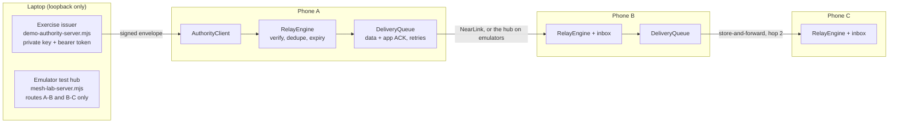

# SafeMesh

**Signed warnings. Offline protective-point maps. A path from one phone to the next.**

HackYeah 2026 · Huawei challenge **“Imagine What’s Next”** · native HarmonyOS app (ArkTS + ArkUI) · minimum API 20, validated on API 24 emulators · also builds for OpenHarmony / Oniro · current release **v1.6.0**

## For the jury: start here

- **Demo video, 2 min 13 s, captioned:** [SafeMesh-1.4.1-demo.mp4](https://github.com/carrotly-technologies-2026/SafeMesh/releases/download/v1.4.1/SafeMesh-1.4.1-demo.mp4), recorded on v1.4.1. The relay flow is unchanged in v1.5.1. Three separate emulator apps side by side: an authenticated issuer on A publishes a custom English alert; B verifies, stores, ACKs and relays it; after A leaves, C receives it from B at hop 2; a forged copy is rejected; then the offline map and the NearLink capability check.
- **Install:** [SafeMesh-1.6.0.hap](https://github.com/carrotly-technologies-2026/SafeMesh/releases/download/v1.6.0/SafeMesh-1.6.0.hap) with its [SHA-256 manifest](https://github.com/carrotly-technologies-2026/SafeMesh/releases/download/v1.6.0/SafeMesh-1.6.0.sha256.txt), both in [Release v1.6.0](https://github.com/carrotly-technologies-2026/SafeMesh/releases/tag/v1.6.0). It is an unsigned debug package for an API 20+ emulator; see [Install the packaged demo](#install-the-packaged-demo).
- **How to run and test everything:** [docs/TEAM_GUIDE.md](docs/TEAM_GUIDE.md) covers commands, expected output of every check, all 177 host tests, the single- and three-emulator walkthroughs, hub fault injection, recording and releases.
- **Challenge areas:** **Human-Centric Technology** (lead) and **Spatial Experiences**. See [Challenge fit](#challenge-fit).
- **HarmonyOS and the open stack:** one codebase builds two products. `default` targets HarmonyOS with the NearLink Kit adapter. `oniro` targets OpenHarmony API 23 for the Eclipse Oniro emulator on Linux, with a NearLink stub. See [OpenHarmony / Oniro build](#openharmony--oniro-build).
- **Platform capabilities:** NearLink Kit, Crypto Architecture Kit, Network Kit, Location Kit, ArkData, Accessibility Kit and Localization Kit. See [Platform capabilities used](#platform-capabilities-used).
- **Real or simulated:** the three app processes, on-device signature checks, store-and-forward with ACKs, rejection of forged content, the offline map and the UI are real. The radio link between emulators is a clearly labelled local WebSocket hub standing in for NearLink, and the issuer is a local exercise signing service. NearLink on physical phones has **not been tested yet**; the test plan is [docs/PHYSICAL_TESTING.md](docs/PHYSICAL_TESTING.md).
- **Built during the hackathon:** all code, tests, data processing and documentation in this repository were written on 3–4 October 2026 at HackYeah, with AI coding agents as disclosed in [AI_WORKFLOW.md](AI_WORKFLOW.md). Pre-existing material: the DevEco Studio *Empty Ability* boilerplate (for example the Huawei Apache-2.0 header in `EntryAbility.ets`), the organizers' DevEco CLI patches, and public PSP and OpenStreetMap data.

## Challenge fit

| Area | What SafeMesh does in the demo |
| --- | --- |
| **Human-Centric Technology** (lead) | Keeps life-safety information usable when mobile networks fail: warnings stay on the phone and pass to the next person automatically. Recipients can trust what they read, because every phone checks the issuer's signature and rejects altered or expired copies, which counters forwarded misinformation. The UI is inclusive: Polish and English, light and dark, large text checked at the system 1.45× preset, screen-reader labels and spoken announcements. It is also responsible about privacy and claims: exercises are labelled as such, location is never stored or relayed, and limits are stated in the app. |
| **Spatial Experiences** | The relay follows physical proximity: only phones in range of each other exchange alerts, and a message walks A → B → C through space. The bundled vector map shows 40 State Fire Service protective points around central Kraków, with straight-line distance from a labelled origin or from one optional foreground location fix. |

## Platform capabilities used

| Capability | HarmonyOS / OpenHarmony API | Source |
| --- | --- | --- |
| NearLink (星闪) device-to-device link: capability check, advertising, scan by exact name, reliable data channel, framed writes | `@kit.NearLinkKit` (`manager`, `advertising`, `scan`, `dataTransfer`), `ohos.permission.ACCESS_NEARLINK` | `transport/NearLinkTransport.ets` |
| On-device ECDSA P-256 / SHA-256 verification against a pinned public key; CSPRNG delivery tokens | `@kit.CryptoArchitectureKit` | `model/AlertProtocol.ets`, `model/DeliveryProtocol.ets` |
| Local WebSocket link between separate emulator apps; bounded loopback HTTP to the exercise issuer | `@kit.NetworkKit` (`webSocket`, `http`) | `transport/EmulatorTransport.ets`, `model/AuthorityClient.ets` |
| One-shot foreground positioning with runtime permission | `@kit.LocationKit` (`geoLocationManager`), `abilityAccessCtrl` | `model/DeviceLocation.ets` |
| Durable local storage with chunked, generation-committed writes | `@kit.ArkData` (`preferences`) | `model/LocalStore.ets` |
| Screen-reader announcements for new alerts, expiry and results | `@kit.AccessibilityKit` | `pages/Index.ets` |
| System language, locale-aware times, explicit PL/EN resource managers | `@kit.LocalizationKit` (`i18n`, `intl`, `resourceManager`) | `pages/Index.ets`, `views/UiCopy.ets` |
| Keep the screen awake only while a relay link is active (user setting, on by default) | `@kit.ArkUI` `window.setWindowKeepScreenOn` | `pages/Index.ets` |
| Short vibration for a newly verified alert, stronger for critical; silent mode applies (user setting) | `@kit.SensorServiceKit` `vibrator`, `ohos.permission.VIBRATE` | `model/AlertFeedback.ets` |
| System dark mode, font scale, system bar colours, `SymbolGlyph` icons, Canvas map | `@kit.AbilityKit` configuration, `@kit.ArkUI` | `entryability/EntryAbility.ets`, `views/OfflineMap.ets` |

## OpenHarmony / Oniro build

The same source also builds an **OpenHarmony** product for the **Eclipse Oniro** emulator (OpenHarmony 6.1, API 23, QEMU on Linux), the open-source European distribution named in the challenge. NearLink Kit exists only in HarmonyOS, so the products differ only where they must:

| | `default` product | `oniro` product |
| --- | --- | --- |
| Runtime | HarmonyOS, target API 24, minimum API 20 | OpenHarmony, API 23, minimum API 20 |
| NearLink transport | `entry/src/harmonyos/transport/NearLinkTransport.ets` (NearLink Kit) | `entry/src/oniro/transport/NearLinkTransport.ets` (always "unsupported") |
| Manifest | `module.json5` as written: `phone`, `ACCESS_NEARLINK` | Adjusted only for this product by the root `hvigorfile.ts`: `default` device type, no `ACCESS_NEARLINK` |
| Signing | Unsigned for emulators; phones are signed locally in DevEco | Public OpenHarmony SDK debug key via `scripts/oniro/sign.sh` |
| Tooling | DevEco Studio / DevEco CLI (Windows, macOS) | `oniro-app build --product oniro` (Linux), see [COMMANDS.md](COMMANDS.md) |

Everything else is shared: the protocol, relay, inbox, issuer console, map, UI and the local emulator test link. `RelayViewModel` imports `entry/transport/NearLinkTransport`, which hvigor resolves from the target's `sourceRoots`. `tests/build-variants.test.mjs` keeps NearLink Kit out of the shared and Oniro sources and checks that both adapters expose the same API.

Status: the Oniro port and its scripts were contributed by a team member, who ran it on the Oniro emulator before the merge. After the merge, the `oniro` product compiles, packages and signs with the OpenHarmony SDK on Windows (the API 24 OpenHarmony part of the DevEco SDK, which has no HMS kits). The produced HAP declares `default`, has no `ACCESS_NEARLINK` and contains the stub, not the NearLink Kit adapter. The team member then ran the merged `oniro` product on the Oniro emulator (API 23) with `scripts/oniro/deploy.sh` and reported that it works. The Oniro scripts also drive three emulators (A, B, C), like the DevEco lab; see [COMMANDS.md](COMMANDS.md).

**Background relaying is deliberately not faked.** Relaying runs while the app is in the foreground. HarmonyOS introduced a NearLink continuous-task mode (`MODE_NEARLINK`) only in API 26. On our API 20–24 target the remaining modes (`dataTransfer`, `bluetoothInteraction`) do not describe a NearLink relay, and the system's consistency check would suspend a mismatched task. Within the foreground limit, the **Keep screen on while connected** setting (on by default) holds the screen awake only while a relay link is active, as navigation apps do. Leaving the app or locking the phone still pauses relaying. The next step is API 26 with `MODE_NEARLINK` and the documented `continuousTaskSuspend` reconnect pattern.

## Architecture



The app follows the MVVM layering from the challenge skills. `pages/Index.ets` is the app shell: state, lifecycle, navigation, the header, the arrival banner and actions. Each screen is its own component in `views/` (`AlertScreens`, `MapScreens`, `RelayScreen`, `GuideScreen`, `SettingsScreen`, `DiagnosticsScreen`, `AuthorityScreen`) and receives ViewModels through `@ObjectLink`. Shared controls are in `views/Controls.ets`. `viewmodel/` holds observable state: `AlertViewModel` for the inbox and verified cache, `RelayViewModel` for transport and delivery, `AuthorityViewModel` for the issuer console and `MapViewModel` for the map. `model/` holds platform-independent policy and I/O: the signed alert protocol, the delivery wire format and queue, storage, location and the authority client. `transport/` implements one `RelayTransport` contract twice, as `NearLinkTransport` for phones and `EmulatorTransport` for the labelled emulator lab. Every phone verifies before it stores, displays, ACKs or forwards; the hub and the transports never sign, store or acknowledge alerts.

## Overview

SafeMesh is a native HarmonyOS hackathon prototype for a civilian problem: losing mobile service should not also mean losing the warning you received or the map that helps you understand where protective places are located.

The app combines on-device signature verification, a bundled central Kraków map, private local storage and a store-and-forward relay with peer acknowledgements and bounded retries. Version **1.4** adds an inbox of current verified alerts, unread status and a separate authenticated exercise-publisher console. The issuer enters a custom alert on A; B and C receive, display and automatically relay verified messages. Recipients have no manual Send action. The interactive map lives in Map, while publisher access and isolated verification tools live in Tests and diagnostics.

Three separate HarmonyOS emulator apps exchange packets through an explicitly labelled local WebSocket transport mock. A separate loopback exercise-authority service signs custom alerts after bearer-token authentication. The app contains its pinned public key, never the private signing key or an embedded access token. Selecting emulator role A alone grants no publication authority. Physical NearLink remains unverified.

**Demo only:** SafeMesh is not connected to RCB or an official warning issuer. Bundled and custom alerts are signed exercises. Mapped PSP protective points are reference records; current access, condition and protection are not verified by the app.

**v1.6.0 (current release):**
- Settings → *Relaying and alerts* has two saved switches, both on by default. **Keep screen on while connected** keeps the window awake only while a relay link is active. **Vibrate on new alerts** gives a short vibration, longer for critical alerts, and respects silent mode.
- The settings footer shows the installed version.
- The 1,150-line UI page was split into screen components (`pages/Index.ets` is now 482 lines).

Checks: **177 host tests**, ArkTS 0 errors for both source sets, Code Linter 0, build OK ([log](artifacts/logs/v160-checks-build.log)). HAP SHA-256 `a66efd9e8f4b8b71b8856d212d27f8f280d3f3e879a521bacbf6d6fe842e3e7d`. Native checks on API 24 emulators:
- [16 of 19 screens are pixel-identical](artifacts/logs/v160-ui-refactor-parity.json) to the pre-refactor build; the rest differ only in a receipt time or scroll offset.
- The three-emulator scenario and the language flow are unchanged.
- [The screen lock goes 0 → 1 → 0 → 1 → 0](artifacts/logs/v160-relay-settings.json) when connecting, switching off, switching on and disconnecting.
- Vibration is attempted only when enabled (emulators have no vibrator), and both settings survive a relaunch.

**v1.5.1:** NearLink capability detection works on HarmonyOS 6.0.x phones (API 20–22). `manager.isNearLinkSupported()` exists only from API 23, and on older systems the call failed, so supported phones were reported as "unavailable". The app now asks it only on API 23+ and otherwise relies on the NearLink system capability. The NearLink APIs used start at API 13 (scan, advertising) and API 18 (data transfer). There are two new adapter tests. Checks: **174 host tests**, ArkTS 0 errors for both source sets, Code Linter 0, build OK ([log](artifacts/logs/v151-checks-build.log)). HAP SHA-256 `5d31a1ca02fd67f4d242d1d14482285ef334c76e80d04e5389596cd7eb21d45d`. On the emulators, the in-app verification test passes and the NearLink check still reports "unavailable".

**v1.5.0:**
- The `oniro` OpenHarmony product was merged next to the HarmonyOS product without changing the HarmonyOS build.
- Settings → App language offers **System / Polski / English**. *System* is the default: it follows the phone's language, Polish on a Polish phone and English otherwise, and it is re-checked when the app returns to the foreground. *Polski* and *English* are explicit, saved choices.

Checks: **172 host tests**, the ArkTS check with **zero errors in 21 files for each product's source set**, **zero Code Linter issues** and a successful HarmonyOS build ([log](artifacts/logs/v150-checks-build.log)). The HarmonyOS HAP has SHA-256 `7663aa1ddee81d4d36b4862b05291cba1ed8c4a35826ed419f5ba85321c5a5ac`. Native checks on the API 24 emulators:
- The [language preference flow passed 5/5 steps](artifacts/logs/v150-language-preference.json), including relaunches.
- A [relay smoke test](artifacts/logs/v150-relay-smoke.json) passed: an exercise loaded on A after connecting reached B at hop 1 with an app ACK, and the real NearLink adapter still loaded.

**v1.4.1:**
- A first launch follows the system language: Polish on a Polish system, English otherwise. Before, it always started in Polish.
- *Load exercise message* now also queues the alert for peers that are already connected.
- The NearLink diagnostics show delivery counters, and transport status, links and errors are logged as `SAFEMESH_TRANSPORT_*` for the physical test.

Checks: **168 host tests**, **21 ArkTS files / zero errors**, **zero Code Linter issues** and a successful build ([log](artifacts/logs/v141-checks-build.log)). The same HAP (SHA-256 `a2cf126786d6a1dce58fe96020fc31c63b776dd7a4593eb2e95d8c9e361ffd3e`) ran the three-emulator scenario in the [demo video](https://github.com/carrotly-technologies-2026/SafeMesh/releases/download/v1.4.1/SafeMesh-1.4.1-demo.mp4). See its [UI action log](artifacts/logs/v141-demo-actions.log), [caption timeline](artifacts/logs/v141-demo-timeline.json) and [capture metadata](artifacts/logs/v141-demo-capture.json).

**v1.4.0 validated:** **167 host tests**, **21 ArkTS files / zero errors**, **zero Code Linter issues**, a successful build and all three emulator smoke checks passed. [17/17 assertions over captured native evidence](artifacts/logs/authority-v14-assertions.json) confirm two custom alerts, ACK-loss recovery, B's saved inbox after restart, and forwarding to C at hop 2 while A and the issuer service are offline. See the [v1.4 validation report](artifacts/research/authority-v14-validation.md) for exact evidence, UI checks and limitations. The [v1.3 report and video](artifacts/research/ui-v13-validation.md) and [v1.2 lab report](artifacts/research/mesh-lab.md) remain historical evidence for those revisions.

## What you can demonstrate

| Screen | Working prototype behavior |
| --- | --- |
| Home / Start | Browse all current verified alerts and unread counts. Open an alert to read its full signed text, issuer, area, issue time and expiry. A new-arrival banner offers **Read alert / Przeczytaj alert** from any screen. Duplicate packets do not create another inbox item, unread count or banner. Home also opens the saved protective point and connection screen. |
| Map / Mapa | Switch between Map and List; search all 40 central Kraków PSP addresses, including searches without Polish diacritics. Select a marker or row to open point details, save it, or show it on the map. Back returns to the originating screen. |
| Relay / Łączność | Choose emulator A/B/C, connect to the local test link and inspect neighbors and ACK/retry counters. Verified alerts relay automatically while connected; there is no recipient Send button. Open diagnostics for verification tools. |
| Guide | Read a short offline preparedness reminder and see what the prototype's verification claim means. |
| Settings / Ustawienia | Open the header gear to choose saved **System / Polski / English** language and **System / Light / Dark** appearance preferences, plus **Keep screen on while connected** and **Vibrate on new alerts**. System follows the device language or appearance. Where a signed language variant exists, the app selects it; otherwise it shows the original with a language notice. |
| Tests and diagnostics / Testy i diagnostyka | Enter from Settings or Relay. Open the authenticated exercise-authority console, load the bundled fixture for verification, run the six-check local test, inspect diagnostics or check NearLink capability. Back returns to the screen that opened diagnostics. |
| Exercise authority / Nadawca ćwiczeń | Enter the local operator's activation code. An authenticated publisher can write a title, instructions and area, choose PL/EN, priority and validity, then publish. The returned signature is verified on-device before the alert is saved and queued automatically. This is an exercise console, not a government account. |

The starter map is inside the HAP, so it is available on first launch without an installation-time download. Its initial origin is explicitly labelled as a demo point at Rynek. Map refresh is a preparation script. Distances are straight-line distances from the labelled origin; the app does not calculate an evacuation route or confirm that an approach is safe.

**Use my location** performs one foreground request after a permission prompt, with a ten-second fix timeout. A usable fix must be inside the bundled area and report accuracy of 250 metres or better. Permission denial, disabled location, timeout, poor accuracy or a position outside the pack preserve the previous origin and show an explanation. The demo origin remains explicit until a fix is accepted, and can be restored manually. Device coordinates are neither saved to disk nor relayed to peers.

A point's saved badge appears only after the native local write completes. Failed saves retain the previous saved point and show an error; valid saved points restore after relaunch. Map search covers all **40 / 40** reference records in this pack.

## Run on Windows

Prerequisites: DevEco Studio with the HarmonyOS 6.1.1 / API 24 SDK, DevEco CLI, Node.js 24, and a running compatible emulator. This workspace used DevEco CLI 1.3.4 and an API 24 phone emulator. Minimum app API is 20; compile/target SDK is 24. Physical NearLink needs a phone with NearLink hardware on API 20 or later. From API 23 the app also asks `manager.isNearLinkSupported()`; on API 20–22 that call does not exist, so the NearLink system capability decides.

For a fresh Windows machine, follow the organizers' [DevEco installation and emulator setup](https://github.com/onirodeveloper/hackyeah2026-challenge/blob/main/quickstart-guide.md). Install the Huawei HarmonyOS SDK, including its HMS kits; a plain OpenHarmony SDK alone does not contain NearLink Kit. The tested toolchain uses Node **24.21.0** and npm **11.19.0**. Keep Node24 on `PATH`; the Studio-bundled Node18 does not satisfy this CLI's requirements.

Install the pinned CLI and its organizer-supplied patches from the complete tools checkout:

```powershell
git clone https://github.com/onirodeveloper/hackyeah2026-challenge C:\src\hackyeah-tools
npm.cmd install -g @deveco/deveco-cli@1.3.4
node C:\src\hackyeah-tools\scripts\apply-devecocli-patches.mjs
node --version
devecocli.cmd -V
```

The patch script and its adjacent patch definitions must stay together. The patches correct lint reporting and disable a problematic CLI memory sampler. These are development-tool changes, not application dependencies or extra app privileges. Python3 is needed only for map refresh and Windows demo recording; Node and the SDK suffice for building the supplied map pack.

Open PowerShell in the project folder. Adjust the Studio directory if installed elsewhere:

```powershell
Set-Location <path-to>\SafeMesh
$env:DEVECO_CLI_STUDIO_PATH = Join-Path $env:USERPROFILE 'DevEcoStudio'   # adjust if installed elsewhere
$env:Path += ';' + (Join-Path $env:APPDATA 'npm')
devecocli.cmd device list --format json
devecocli.cmd build
if ($LASTEXITCODE -ne 0) { throw 'SafeMesh build failed' }
devecocli.cmd run --skip-build --module entry --device 127.0.0.1:5555
```

Use the actual device name or serial reported by `device list`. To start the already configured local emulator, use `devecocli.cmd emulator start HackYeahPhone`. A fresh computer needs a phone instance and system image configured first.

`devecocli run --skip-build` installs the existing build and launches `org.safemesh.alerts/EntryAbility`; it can also be rerun to relaunch the demo without rebuilding.

For a single-emulator rebuild, the helper reads `versionName` from `AppScope/app.json5`, builds, writes `dist/SafeMesh-<versionName>.hap` (currently 1.4.1) and its HAP-only SHA-256 manifest, and deploys it. Historical packages are preserved. The authority launcher below uses the build output directly:

```powershell
.\scripts\run-demo.ps1
```

Use `-Device <serial>` for another target or `-NoRun` to build/package only. If `DEVECO_CLI_STUDIO_PATH` is unset, the helper tries `<user-profile>\DevEcoStudio`; DevEco CLI must already be on `PATH`.

### Install the packaged demo

Download `SafeMesh-1.6.0.hap` and `SafeMesh-1.6.0.sha256.txt` from [Release v1.6.0](https://github.com/carrotly-technologies-2026/SafeMesh/releases/tag/v1.6.0). The HAP is the HarmonyOS `default` product as a debug **unsigned emulator package**, built as `entry/build/default/outputs/default/entry-default-unsigned.hap`, with SHA-256 `a66efd9e8f4b8b71b8856d212d27f8f280d3f3e879a521bacbf6d6fe842e3e7d`. It installs on an API 20+ HarmonyOS emulator. A physical phone needs a debug-signed build; see [docs/PHYSICAL_TESTING.md](docs/PHYSICAL_TESTING.md#3-signing-for-physical-devices).

```powershell
$hdc = Join-Path $env:DEVECO_CLI_STUDIO_PATH 'sdk\default\openharmony\toolchains\hdc.exe'
(Get-FileHash .\SafeMesh-1.6.0.hap -Algorithm SHA256).Hash   # compare with the manifest
& $hdc list targets
& $hdc -t 127.0.0.1:5555 install -r .\SafeMesh-1.6.0.hap
& $hdc -t 127.0.0.1:5555 shell aa start -b org.safemesh.alerts -a EntryAbility
```

Use the serial printed by `hdc list targets`. The last command alone relaunches an installed app. No production certificate or private issuer key is included.

[Release v1.4.1](https://github.com/carrotly-technologies-2026/SafeMesh/releases/tag/v1.4.1) remains available with its HAP and the demo video. Packages from earlier checkpoints (v1.4.0 `dd7ca2cd…`, v1.3, v1.2 and v1.1) were written to the git-ignored `dist/` folder of the development machine and are not part of the repository. Their hashes and validation records remain in `artifacts/` and the reports linked below.

## Publish a custom alert to three emulators

Configure three existing API 24 phone emulators named `HackYeahPhone`, `SafeMeshB` and `SafeMeshC`, then run:

```powershell
$env:DEVECO_CLI_STUDIO_PATH = Join-Path $env:USERPROFILE 'DevEcoStudio'
powershell -NoProfile -ExecutionPolicy Bypass -File scripts/start-authority-demo.ps1
```

The launcher prepares or reuses the persistent local exercise key, ensures the app pins its public key and delegates the shared build and three-app deployment to `start-mesh-lab.ps1`. It starts or verifies the loopback authority service at `127.0.0.1:8768` and configures its reverse port only for the named emulator A. The mesh helper discovers actual device serials, starts the named instances and loopback hub, checks reverse ports and installs the same HAP on all three. No internet service is required during the prepared demo.

Use `-EmulatorA`, `-EmulatorB` and `-EmulatorC` for other instance names and `-DeviceTimeoutSeconds` to change the default 180-second startup wait. `-SkipBuild` can reuse a build only when its authority-key proof matches; a newly adopted or mismatching public key forces a rebuild. The launcher does not create/download emulators, accept licences, uninstall apps or erase their data. Authority logs are in `.cache/demo-authority/launcher-<timestamp>/`, its PID in `.cache/demo-authority/server.pid`, and mesh logs in `.cache/mesh-lab/`.

The [recorded Windows launcher run](artifacts/logs/authority-v14-launcher-final.log) passed with three uniquely resolved devices, visible A–B/B–C topology, reuse of the verified issuer and `-SkipBuild` backed by a matching build receipt. Its earlier full-build fallback also preserved the validated HAP hash. Reused hub topology and loss controls remain visible; inspect them before each demonstration.

1. In **Relay / Łączność**, choose A/B/C on the corresponding emulator and select **Connect / Połącz**. Keep each app in the foreground. Connection role and publisher authorization are separate.
2. On A, open the Settings gear → **Tests and diagnostics / Testy i diagnostyka** → **Exercise authority / Nadawca ćwiczeń**. Obtain the activation code from the local operator's `.cache/demo-authority/session-token.txt`, enter it in the masked field and sign in. Do not include that file or its contents in screenshots, logs, Git or release archives.
3. Enter the custom title, instructions and area. Select the alert's language, priority and validity (15 minutes, 1 hour, 4 hours or 24 hours), then choose **Publish alert / Opublikuj alert**. The signing key remains in the host authority service. A verifies the returned signed envelope before saving and automatically queuing it.
4. B and C receive valid messages without a Send action. Use the new-alert banner or Home inbox to open the full alert. Unread status is local to each receiving app; duplicate retransmissions do not create another unread alert or banner.
5. The signed custom alert has one selected language. The UI can remain Polish or English independently. If the alert has no matching signed translation, the receiver displays its original text and an original-language notice; the app does not invent a translated signed message.

The activation code is a local demo bearer token, not production government identity. It is kept in the app's memory for the authenticated session and cleared on sign-out or app disposal; it is not persisted in app preferences. The private key and token remain in ignored `.cache/demo-authority/`, outside the HAP and source archive. Publication status means signed and queued, or saved while awaiting neighbors; it does not claim delivery or human reading.

The visible emulator-transport label distinguishes this mode from NearLink radio. The hub routes only configured A–B/B–C edges, never a direct A–C link, and does not store or acknowledge alerts. Leaving the app foreground pauses its link and timers. Returning resumes only a previously active connection; an explicit Disconnect stays disconnected. After a fresh process launch, use Connect again.

The [v1.4 native report](artifacts/research/authority-v14-validation.md) records two custom messages from the authenticated A console. **B accepted both at hop 1**, recovered a deliberately lost ACK and retained the read inbox after a real process restart. With A and the issuer service stopped and only B–C linked, **C accepted both at hop 2**. A genuine duplicate received an ACK without another unread item; tampered content received no ACK and did not replace verified text. The [v1.3 native report](artifacts/research/ui-v13-validation.md#three-process-delivery-on-the-final-hap) and [v1.2 lab report](artifacts/research/mesh-lab.md) preserve the earlier fixture-based runs.

For fixture-only transport development, `scripts/start-mesh-lab.ps1` remains available. To refresh an expired bundled fixture after the authority and public pin are prepared, rebuild and redeploy **all three apps together**:

```powershell
powershell -NoProfile -ExecutionPolicy Bypass -File scripts/start-mesh-lab.ps1 -RefreshDrill
```

This refreshes fixture dates and signatures using the existing local key; it does **not** rotate that key. Do not combine it with `-SkipBuild`, or refresh only one emulator. The fixture/control helpers are `scripts/mesh-lab-fixtures.mjs` and `scripts/mesh-lab-control.mjs`; their commands and effects are documented in the lab report.

## A two-minute single-emulator demo

This walkthrough uses the bundled verification fixture and does not require the publisher service. Use the three-emulator walkthrough above to publish your own text.

1. Start on **Home / Start**: the empty state offers **Connect devices / Połącz urządzenia**. Open the header gear, then **Tests and diagnostics / Testy i diagnostyka** → **Load exercise message / Wczytaj wiadomość ćwiczebną** (`diagnosticDrill`). Choose **Read alert / Przeczytaj alert** in the banner, or return to Home and open the inbox row, to inspect the verified text and expiry. Opening it clears its unread status.
2. Open **Map / Mapa**. Search an address with or without Polish diacritics (`searchPoints`), switch Map/List, and open a marker or result. In point details, save the point (`savePoint`), use **Show on map / Pokaż na mapie**, or go Back. Home should show the saved address; the map remains on its own tab.
3. Open **Settings / Ustawienia** and switch **System / Polski / English** (`languageSystem` / `languagePl` / `languageEn`). The bundled fixture includes both signed language versions. Custom alerts retain their signed original when no matching translation exists. Try Light/Dark/System, then relaunch to check stored preferences, saved content and read status.
4. Open diagnostics from Settings or Relay, then **Run verification test / Uruchom test weryfikacji** (`runRelay`). The intended result is six passing checks: A → B → C, duplicate suppression, forged-content rejection and expiry rejection. This test runs within one app process.
5. In diagnostics, **Check NearLink support / Sprawdź obsługę NearLink** (`checkNearLink`) shows the emulator's unsupported-radio result. Use the three-emulator walkthrough above for actual inter-app packet exchange over the local transport mock.

### Record the emulator demo

The Windows recorders capture only `Emulator.exe` client windows through `PrintWindow` and encode with the FFmpeg bundled with DevEco Studio. Keep the emulator windows visible and their size unchanged while recording. For one emulator:

```powershell
python scripts/record-demo.py --duration 120 --output dist/SafeMesh-single-demo.mp4
```

For the three-emulator view used in the v1.4.1 video, `record-mesh-demo.py` captures A, B and C in one loop per frame, so timing across devices is real. Find the process IDs with `Get-CimInstance Win32_Process -Filter "Name='Emulator.exe'" | Select ProcessId, CommandLine`:

```powershell
python scripts/record-mesh-demo.py --pids <A-pid> <B-pid> <C-pid> --output dist/SafeMesh-mesh-demo.mp4 --stop-file .cache\stop-recording.flag
```

Use `--studio <directory>` for a different Studio installation or `--pid <Emulator.exe PID>` when multiple emulator windows are open. Python's standard library is sufficient. The recorder refuses to overwrite an existing output.

The [v1.4.1 demo video](https://github.com/carrotly-technologies-2026/SafeMesh/releases/download/v1.4.1/SafeMesh-1.4.1-demo.mp4) is a single take of that three-emulator recording, 142.5 s of live capture at 12 fps with zero late frames. The UI steps were driven by `uitest uiInput` commands and are logged with timestamps in the [action log](artifacts/logs/v141-demo-actions.log). The activation code was typed into the masked field and is not in any log. In the final cut, sign-in and character-by-character typing (raw 20–56 s) play at 3× speed with an on-screen badge. A title card, device labels, captions and an end card were added from the [caption timeline](artifacts/logs/v141-demo-timeline.json). Nothing else was edited.

The historical v1.3 demo video (not in the repository) is a reviewed, silent **90-second native-window recording** showing its Home, offline Map/list/detail, Guide and PL/EN with light/dark settings. It has 1350 frames at 15 fps and zero late capture frames; [capture and review evidence](artifacts/logs/newui-v13-video-review.json). It predates the inbox and publisher console. Its packet logs establish the v1.3 three-emulator exchange separately. The historical `dist/SafeMesh-demo.mp4` and its [v1.1 validation record](artifacts/VALIDATION.md) are preserved. Recording does not publish or upload anything.

### Refresh an expired exercise

The checked-in bilingual fixture expires at **2026-10-06T19:57:54.231Z**. Its validity is intentionally limited to 72 hours. The app rejects it after that time. Custom alerts have their separately selected 15-minute to 24-hour validity.

Once the local authority has been prepared and its public key matches the app, regenerate the bundled fixtures, rebuild, repackage and redeploy before a later presentation:

```powershell
.\scripts\run-demo.ps1 -RefreshDrill
```

The helper invokes `node scripts/generate-demo-alerts.mjs` before building. The generator signs refreshed fixtures with the **persistent local key** from `.cache/demo-authority/authority.json`. It neither rotates the key nor silently replaces a mismatching app pin. For first setup, use `start-authority-demo.ps1`; it prepares the local authority and explicitly adopts its public key before rebuilding all three apps. Private material and the bearer token stay in the ignored local authority directory, never in the HAP or source ZIP.

For a later three-emulator fixture refresh with the matching local key, use `start-mesh-lab.ps1 -RefreshDrill` so all three receive the same new build. A deliberate key rotation is a separate operator action requiring the service to be stopped and the prior receipt journal preserved; it also requires updating the public pin and rebuilding all receivers. Ordinary fixture refresh does not invalidate older valid alerts by changing their trust key. `mesh-lab-fixtures.mjs` only derives fault-test packets from existing signatures; it does not refresh dates or rotate keys.

## Reproducible checks

The host suites execute actual checked-in `.ets` implementation after transpilation/type erasure. Platform radio, preferences and Canvas are mocked where necessary; host cryptography uses Node/OpenSSL. These tests complement native checks.

```powershell
$env:DEVECO_CLI_STUDIO_PATH = Join-Path $env:USERPROFILE 'DevEcoStudio'
.\scripts\check.ps1 -Build
```

The helper discovers every `tests/*.test.mjs` suite and runs host tests. It runs the DevEco CLI ArkTS check once per product source set (`harmonyos` and `oniro`), each in a temporary mirror, because DevEco CLI 1.3.4 does not resolve target `sourceRoots`. It then runs Code Linter, then builds the entry module when `-Build` is present. It stops on a nonzero exit and reports `CHECKS: PASS` only after the requested checks complete. Omit `-Build` for checks without packaging; use `scripts/run-demo.ps1` afterward to package/deploy the build.

| Suite | Coverage |
| --- | --- |
| `tests/protocol.test.mjs` | Genuine signatures, signed v2 translations, exact v1 canonical compatibility, malformed/unsigned language rejection, trust scope, expiry, replay, bounded parsing/cache, restore and native empty-encoder regression. |
| `tests/alert-display.test.mjs` | Actual ViewModel with real ECDSA: PL/EN selection, original-language fallback, forged translation rejection, restore, expiry fallback and paused/resumed timers. |
| `tests/inbox.test.mjs` | Multiple verified messages, detail selection independent of latest alert, duplicate/unread handling, revisions, read-state persistence, expiry and language snapshots. |
| `tests/authority.test.mjs` | Local signing-service authentication, bounded custom drafts, signatures, idempotent publication and durable receipt behavior. |
| `tests/authority-client.test.mjs` | Actual authority client/ViewModel with platform mocks: trusted-service matching, token handling, response checks and publication flow. |
| `tests/localization.test.mjs` | Matching base/EN/PL resource keys, localized state families and removal of raw English interface diagnostics. |
| `tests/nearlink.test.mjs` | Capability gate, exact-name discovery, confirmed connections, MTU framing, split/coalesced reads, invalid input and cleanup. |
| `tests/map.test.mjs` | Dataset preservation, attribution, geometry, coordinate projection, selection, distances, clipping and Canvas submission bounds. |
| `tests/integration.test.mjs` | ViewModel persistence/restore, rejected-input handling, forwarding, concurrency, errors and expiry. |
| `tests/storage.test.mjs` | Native string-size limits, chunked snapshots, generation commits, interrupted writes, initialization and concurrent access. |
| `tests/delivery.test.mjs` | Full-cache synchronization, delayed/reconnected peers, strict ACK matching, loss/retry policy, expiry, deadlines, transport switching, retired callbacks, foreground lifecycle and three independent ViewModels. |
| `tests/location.test.mjs` | Native one-shot location permission/capability handling, usable results and failure paths. |
| `tests/emulator-transport.test.mjs` | Actual ArkTS WebSocket adapter with platform mocks: handshake, peer updates, packet bounds, sender filtering, deadlines, error diagnostics and stop races. |
| `tests/feedback.test.mjs` | Alert vibration: preset or timed fallback, `alarm` usage for critical alerts, no exception when the device has no vibrator. |
| `tests/build-variants.test.mjs` | HarmonyOS / Oniro product split: Oniro stub behavior, matching adapter APIs, NearLink Kit confined to `src/harmonyos`, unchanged HarmonyOS product and manifest. |
| `tests/mesh-lab-server.test.mjs` | Actual local sockets and RFC WebSocket framing, topology, injected loss, malformed input, host/origin checks, heartbeat cleanup and public fixture derivation. |

Tests discover the TypeScript compiler inside DevEco Studio through `DEVECO_CLI_STUDIO_PATH`; see [NearLink evidence](artifacts/research/nearlink.md) for fallback locations. Protocol/integration/storage tests also accept `ARKTS_TYPESCRIPT_PATH`. The map suite uses Node 24's type-erasure support. Host fixture time is controlled inside the relevant tests; the native app uses the actual device clock.

**Version 1.4:** **167 host tests passed**, **21 ArkTS files / zero errors** with **36 separate permission, exception and deprecated-API advisories**, **zero Code Linter issues**, and a successful HAP build in the [combined log](artifacts/logs/authority-v14-final-checks-build.log). All three native [emulator deployments](artifacts/logs/authority-v14-final-deploy.log) reported **Smoke: PASS**; [17/17 checks over captured native evidence](artifacts/logs/authority-v14-assertions.json) passed. The [v1.4 report](artifacts/research/authority-v14-validation.md) records custom publication, inbox/read state, ACK recovery, restarted-B forwarding with the issuer offline, duplicate/tamper rejection, PL/EN display and the actual **1.45× Huge** system text preset.

**Historical version 1.3 checks:** **130 host tests passed**, **19 ArkTS files / zero errors** with 34 separate permission, exception and deprecated-API advisories, **zero Code Linter issues**, and a successful HAP build. See the [final check/build log](artifacts/logs/ui-v13-final-checks-build.log). All three emulator deployments passed smoke checks; [13/13 assertions over native evidence](artifacts/logs/ui-v13-native-results.json) passed. UI validation covered PL/EN, light/dark/system appearance, saved-point restoration and the real **1.45× Huge** system text preset. These results do not establish the v1.4 publisher/inbox behavior.

Historical **v1.2** check/build passed **96 host checks across nine suites**, **19 ArkTS files / zero errors** with 29 separate advisories, **zero lint issues** and **BUILD SUCCESSFUL**. See the [combined log](artifacts/logs/mesh-lab-final-checks-build.log), [8 / 8 native relay-scenario assertions](artifacts/logs/mesh-lab-native-results.json), and [automatic stale-connection removal after B restarted](artifacts/logs/mesh-lab-08-stale-peer-removed.json). The [lab report](artifacts/research/mesh-lab.md) identifies the exact builds used. These are not v1.3 results.

Historical **v1.1** evidence remains available: **61 host checks / seven suites**, **17 ArkTS files / zero errors**, lint/build and **Smoke: PASS** in the [checks log](artifacts/logs/v11-checks.log), [run log](artifacts/logs/v11-run.log) and [validation record](artifacts/VALIDATION.md). Native-icon navigation, gear/back behavior and a [same-host clean-checkout build](artifacts/logs/v11-clean-checkout.log) were verified for that revision only.

Required native checkpoints include a successful HAP build and launch, **6 / 6** signature/relay drill checks, explicit unavailable NearLink radio on the emulator, and restored alerts/saved points after relaunch. Device location, themes and large-text behavior need their own recorded interaction checks. Permission/exception advisories from the ArkTS checker are separate from Code Linter results; the manifest declares the needed permissions and the corresponding native adapters request them at runtime. An emulator smoke check alone is not proof of every feature.

## Transport and signature design

```text
Trusted issuer signs alert
          │
          ▼
Phone A ──► Phone B retains alert ──► Phone C
 verify       verify + dedupe          verify
          signature remains unchanged
```

The relay engine authenticates a bounded, canonical payload before displaying or forwarding it. A pinned exercise public key can authorize exercises only. The local authority holds the private key, authenticates publication with an operator token and returns a signed envelope. A verifies that envelope using the same recipient engine before it enters the relay queue; B and C need only the public key. This local service demonstrates the issuing role, not production government authentication or key custody.

Accepted messages are copied into a bounded cache, revisions are checked, expired messages are removed and replay history is re-verified when restored. Home lists current unique alerts, with local unread/read state persisted separately. A duplicate does not create a new unread item or arrival banner. Opening an older alert does not replace the newest cached alert, and expiry removes stale inbox entries. The maximum cooperative hop budget is eight; an unsigned hop counter is not proof of an adversary's path length. Detail-screen receipt time, previous device and hop count are explicitly local test metadata, not an authenticated chain or human-read receipt.

Version 2 signs the source language and every alternate title, body and area under the separate `SafeMesh.Alert.v2` canonical domain. The bundled fixture contains a Polish original and one English alternate. Custom publication signs the one language chosen by its author. Only `pl` and `en` are accepted; duplicates, malformed alternatives and oversized content are rejected. The complete canonical content remains bounded to 4 KiB. Switching UI language selects already-verified content when available and otherwise labels the original-language fallback. Packet bytes and signature remain unchanged.

Version 1 canonical bytes remain exact. A valid v1 alert displays its original text with an explicit unknown-language fallback; unsigned translation metadata is rejected. A v2 alert missing the requested alternate also shows a labelled original-language fallback. Old-format support does not bypass the pinned key, signature or expiry checks. When the visible alert expires, the app selects the newest still-valid cached alert, or clears the alert if none remain.

NearLink provides device-to-device links; SafeMesh supplies the application relay policy. The public adapter uses `@kit.NearLinkKit`, `ohos.permission.ACCESS_NEARLINK`, a custom application UUID and reliable byte transfer. Its bounded framing allows a message to span the negotiated MTU.

The app synchronizes **all current verified cached alerts** with a delayed or reconnected peer, using the same relay policy over the local emulator link and the optional NearLink adapter. The foreground queue is limited to eight peers and 128 alerts per peer, sends at most four packets per batch, and rechecks cache membership and expiry before sending. Each item gets at most three attempts per connection, with bounded ACK waits and a three-second wait for each native send. Expired items leave the queue. Background suspension stops links and timers; foreground recovery reconnects a previously active link and resynchronizes valid saved content. Explicit Disconnect cancels recovery.

An ACK must match the expected connected peer, a fresh random delivery token, the issuer key ID, alert ID and revision. Receivers ACK only a verified accepted message or a verified duplicate; duplicates are acknowledged again to recover from ACK loss, without being forwarded again. Forged or expired data never gets a success ACK. Local write success alone is not recorded as acknowledged delivery. Legacy raw signed alerts are still accepted on input; ACK-based delivery requires a compatible current peer.

**An acknowledgement is a cooperative receiving-app receipt.** It does not prove a human read the message or that a hostile peer will pass it on. It does not confer authority on message content. Storage errors remain visible separately, and the foreground prototype makes no background-delivery guarantee.

API 24 requires a discovery filter and does not support a service-UUID scan filter. The prototype therefore asks for the other phone's exact NearLink device name. It does not invent a manufacturer identifier to bypass this constraint. The emulator cannot test NearLink scanning, connections or data transfer. Details and official source links: [NearLink research](artifacts/research/nearlink.md) and [security protocol](artifacts/research/security.md).

## Map sources and attribution

The bundled pack contains 40 selected PSP protective points near central Kraków, with original names, addresses and access categories. It is a subset of the published inventory, not a complete city listing. PSP data publication date: **2026-09-28**. OSM geometry snapshot: **2026-10-03**.

**© OpenStreetMap contributors (ODbL) · Komenda Główna PSP (CC BY 4.0).**

- [PSP dataset on dane.gov.pl](https://dane.gov.pl/pl/dataset/28058,punkty-schronienia-w-polsce/resource/1393918)
- [OpenStreetMap copyright and attribution](https://www.openstreetmap.org/copyright)
- [ODbL 1.0](https://opendatacommons.org/licenses/odbl/1-0/)
- [Map provenance, licensing and limitations](artifacts/research/maps.md)

The pack uses vector data from a bounded Overpass query, not bulk downloads from the OSM community raster-tile server. Original metadata, source URLs, dates and hashes are in `entry/src/main/resources/rawfile/map-pack.json`. Retain attribution and the applicable data licences when redistributing the map.

Maintainer refresh, with internet access and Python:

```powershell
python scripts/refresh-map.py
node --test tests/map.test.mjs
devecocli.cmd build
```

This refresh contacts public data services and should be run deliberately during preparation, not automatically for every app launch.

## Project layout

```text
entry/src/main/ets/
  pages/Index.ets                 App shell: state, lifecycle, navigation, banner, actions
  views/*Screen(s).ets            One component per screen (home, map, relay, guide, settings, diagnostics, issuer)
  views/Controls.ets              Shared controls; Theme.ets colours; Format.ets time formatting
  views/OfflineMap.ets            Canvas vector map
  model/AlertFeedback.ets         Vibration for new alerts
  viewmodel/                     Inbox, authority, relay and map state
  model/AuthorityClient.ets       Authenticated loopback exercise-publication client
  model/AlertProtocol.ets         Signature, trust and relay policy
  model/DeliveryProtocol.ets      Bounded data/ACK wire format
  model/DeliveryQueue.ets         Foreground peer synchronization and retries
  model/LocalStore.ets            Private local preferences
  model/DeviceLocation.ets        Optional one-shot native location
  model/DemoAlerts.ets            Signed exercise fixtures
  model/DemoTrust.ets             Exercise public key only
  model/OfflineMapData.ets        Bundled reference data
  transport/RelayTransport.ets    Shared link contract and status types
entry/src/harmonyos/transport/NearLinkTransport.ets  NearLink Kit adapter (default product)
entry/src/oniro/transport/NearLinkTransport.ets      NearLink stub (oniro product)
hvigorfile.ts                     Oniro-only manifest adjustments
signatures/                       Public OpenHarmony SDK debug signing inputs (oniro product)
scripts/oniro/                    Oniro emulator, signing, deploy, services, send-alert
COMMANDS.md                       Linux / Oniro workflow
  transport/RelayTransport.ets    Shared packet-link contract
  transport/EmulatorTransport.ets Local WebSocket link between separate emulator apps
scripts/prepare-demo-authority.mjs Persistent local demo key and token setup
scripts/demo-authority-server.mjs  Authenticated host signing service
scripts/start-authority-demo.ps1   Shared authority/mesh setup and three-app deployment
scripts/                         Checks, build/package, map refresh, fixture generation, recorder, mesh lab
tests/                           Host tests of application sources
artifacts/research/              Primary-source evidence and limitations
artifacts/logs/                   Build and validation records
artifacts/screenshots/            Native emulator captures
docs/PHYSICAL_TESTING.md          Runbook for the first physical NearLink test
docs/TEAM_GUIDE.md                How to build, run, test, record and release; submission status
scripts/record-mesh-demo.py       Synchronized three-emulator recorder
dist/                             Git-ignored local packages; releases are on GitHub
```

Release v1.6.0 on GitHub carries `SafeMesh-1.6.0.hap` and `SafeMesh-1.6.0.sha256.txt`, plus the v1.4.1 demo video. Earlier releases keep their own HAPs; v1.4.1 also holds the video.

## Validation scope

The current target is API 24 emulators. The v1.4.1 demo run repeated custom publication, hop-1 and hop-2 delivery with A out of range, and forged-copy rejection on the final HAP. Native v1.4 checks cover two custom signed alerts, recipient inbox/unread behavior, exact text display, ACK loss, B restoration after process restart, and B → C delivery while the issuer is unavailable. The captured-evidence checker passes 17/17 assertions. The local hub is an intentional transport mock. Physical NearLink, radio range, battery behavior and background delivery are outside the demonstrated scope; neither these checks nor the historical v1.3 video establish production readiness.

A deployable warning service also needs an authorized issuer, audited key custody/rotation/revocation, a trusted-time policy, fresh protective-point access information and operational review. Signatures cannot prevent jamming, message dropping or compromised authority keys. No range, guaranteed delivery or certified shelter safety is claimed by this hackathon build.

AI-assisted development is disclosed in [AI_WORKFLOW.md](AI_WORKFLOW.md). The application itself does not use an AI inference service.

Paste-ready submission text, cover image and opening instructions are in [SUBMISSION.md](SUBMISSION.md).

## License

Source code, scripts and documentation: [Apache License 2.0](LICENSE). Bundled map data keeps its own licences and attribution requirements: OpenStreetMap-derived geometry is © OpenStreetMap contributors under the [ODbL 1.0](https://opendatacommons.org/licenses/odbl/1-0/), and protective-point records come from Komenda Główna PSP under [CC BY 4.0](https://creativecommons.org/licenses/by/4.0/). This applies to `entry/src/main/resources/rawfile/map-pack.json` and `entry/src/main/ets/model/OfflineMapData.ets`; see [Map sources and attribution](#map-sources-and-attribution).
