# SafeMesh pitch deck

16 slides for the HackYeah 2026 jury. **[Open the PDF](SafeMesh-pitch.pdf)**, or open [`deck.html`](deck.html) in a browser (arrow keys, F for full screen). The PPTX with speaker notes and the PDF are also attached to the latest GitHub release.

Rendered by `python scripts/render-pitch.py`. Phone images are real emulator screenshots from [the screen gallery](../gallery/README.md) and the demo recording, including the three phones on the title slide.

### 1. SafeMesh

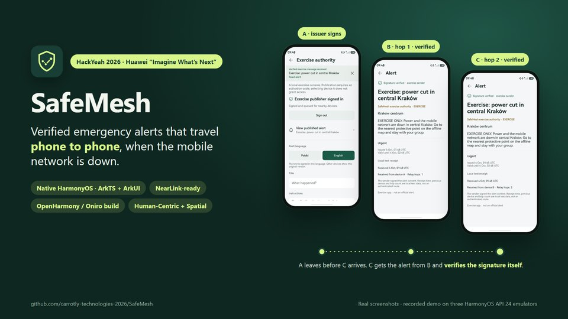

> SafeMesh is a native HarmonyOS app for one narrow, real problem: getting a trustworthy warning to people when the mobile network is down. Everything in this deck is backed by the repository: code, tests, logs and recorded emulator runs. The three phones on this slide are real stills from the recorded demo: A signs and publishes, B verifies at hop 1, and C verifies at hop 2 after A has left. Every phone image in this deck is a real emulator screenshot.

### 2. The problem

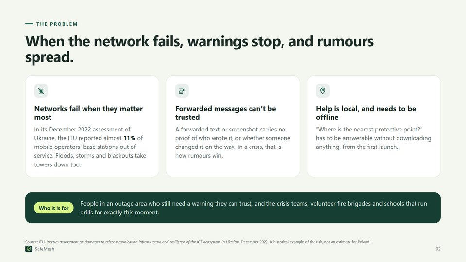

> Three connected needs. First, connectivity: a documented example is Ukraine, where the ITU counted almost 11 percent of mobile base stations out of service. Second, trust: a forwarded message has no proof of origin or integrity. Third, local reference information that works offline. SafeMesh addresses all three in one app.

### 3. The solution

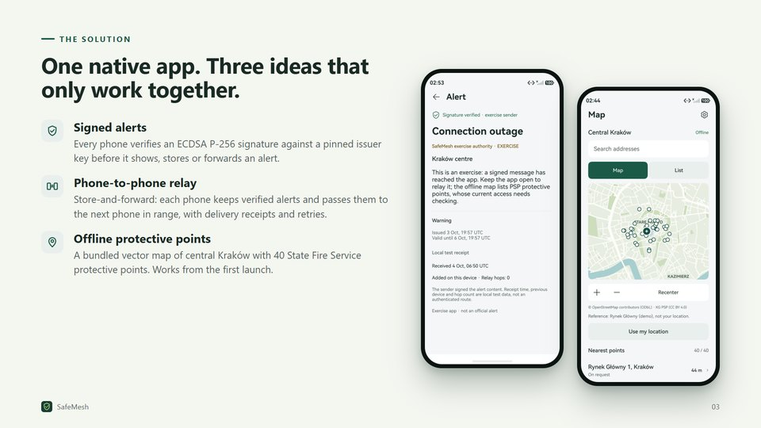

> Signatures alone do not help if the alert cannot reach you; a mesh alone spreads rumours as fast as facts; a map alone tells you nothing about what is happening. Together they give a verified warning plus the local information to act on it. Both phones are real screenshots from the HarmonyOS API 24 emulator.

### 4. How a warning travels

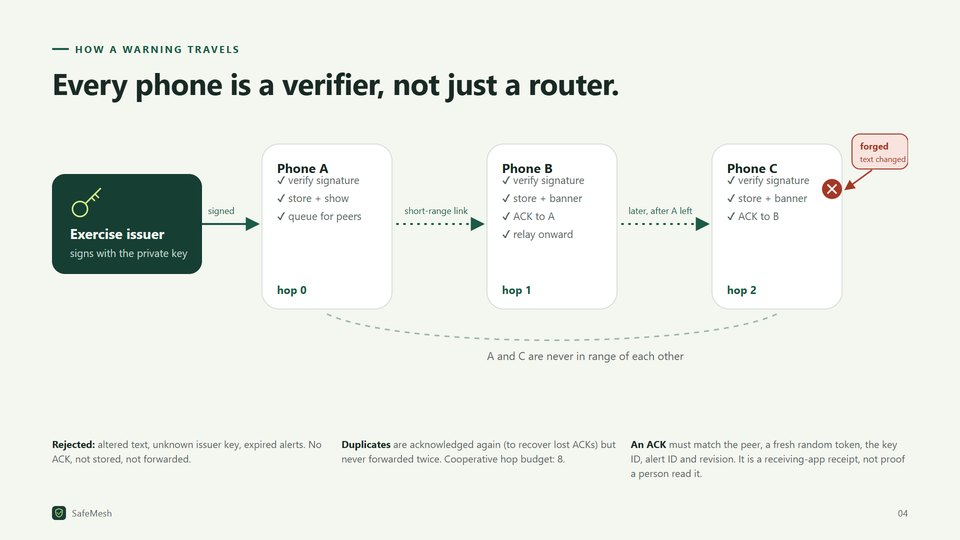

> The issuer signs once. Phone A verifies and queues it. When A meets B, B verifies, stores, shows a banner, acknowledges and relays. Later A is gone, B meets C, and C receives the alert at hop 2 although A and C were never in range. A forged copy with changed text fails the signature check at C: no acknowledgement, not stored, not forwarded. This is the exact scenario in the demo video.

### 5. It runs

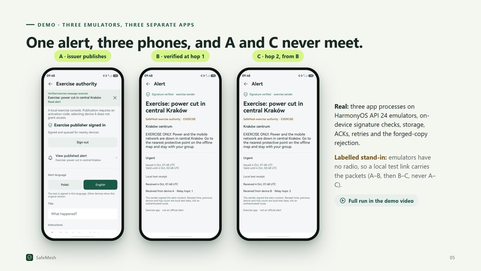

> These are stills from the recorded demo. A is the authenticated exercise issuer and publishes a custom alert. B verifies it at hop 1. Then A leaves, B meets C, and C receives it at hop 2. The test link is clearly labelled in the app as an emulator stand-in for NearLink; everything above the link is the real app.

### 6. Trust model

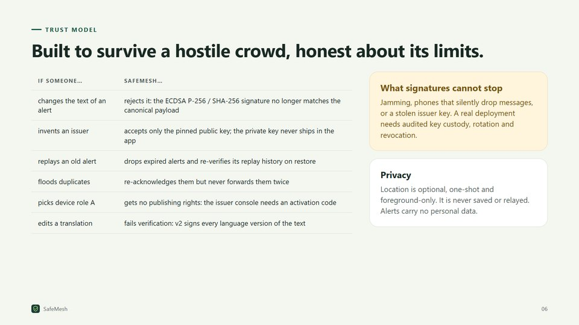

> Each row is covered by host tests running the actual ArkTS code with real ECDSA: protocol, alert display, inbox, delivery and integration suites. We also state what signatures cannot do: jamming, dropping, or a compromised issuer key are outside what a signature can prevent.

### 7. Offline map

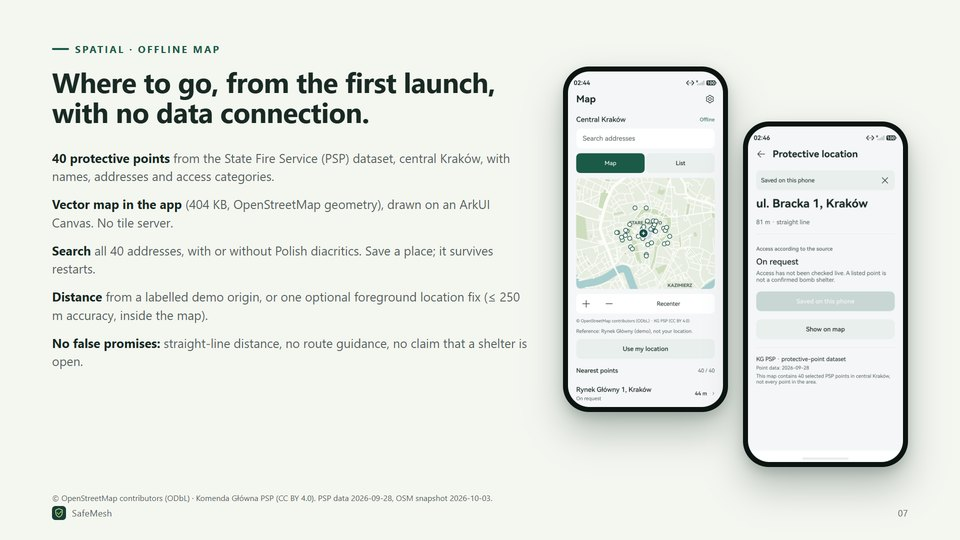

> The map pack is built by scripts/refresh-map.py from public data and ships inside the HAP. Map tests cover dataset preservation, projection, distances and Canvas bounds. Location uses one foreground request with a ten-second timeout; poor accuracy or a fix outside the pack keeps the labelled origin.

### 8. Human-centric

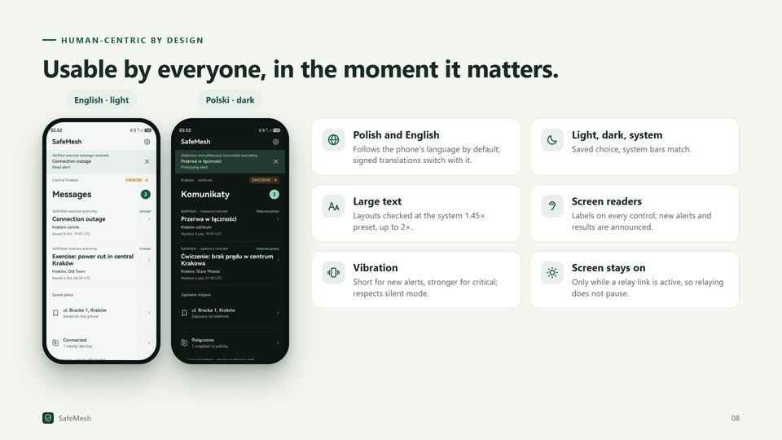

> Both screenshots show the same inbox state: English light and Polish dark. The full gallery in docs/gallery shows all 17 screens in four variants. Vibration and keep-screen-on are settings, both on by default.

### 9. Built on HarmonyOS

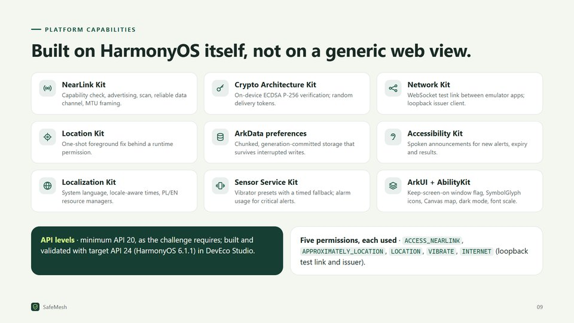

> Each tile maps to a source file listed in the README table "Platform capabilities used". The app declares only the permissions it uses: NearLink, approximate and precise location, vibration, and internet for the loopback test link and issuer.

### 10. NearLink

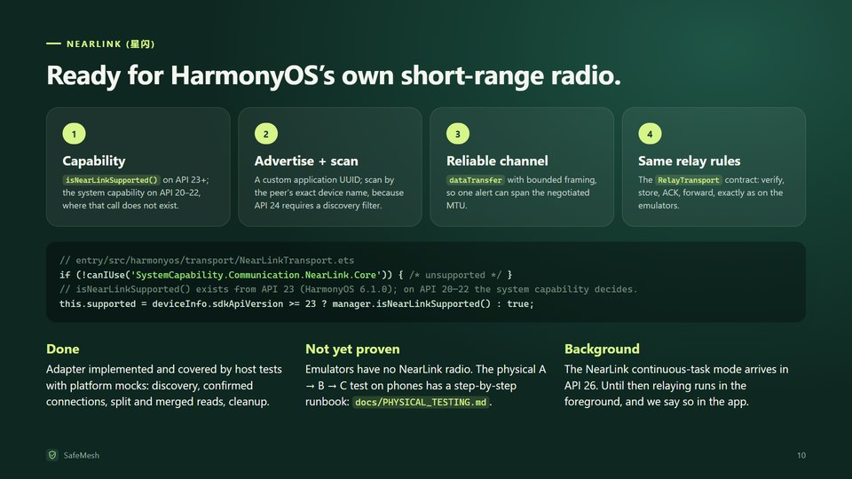

> NearLink is the platform feature SafeMesh was designed around. The adapter is real code, entry/src/harmonyos/transport/NearLinkTransport.ets. We found and fixed a real compatibility issue: isNearLinkSupported only exists from API 23, so on HarmonyOS 6.0 phones the app now relies on the system capability. We do not claim a physical radio test yet.

### 11. One codebase, two systems

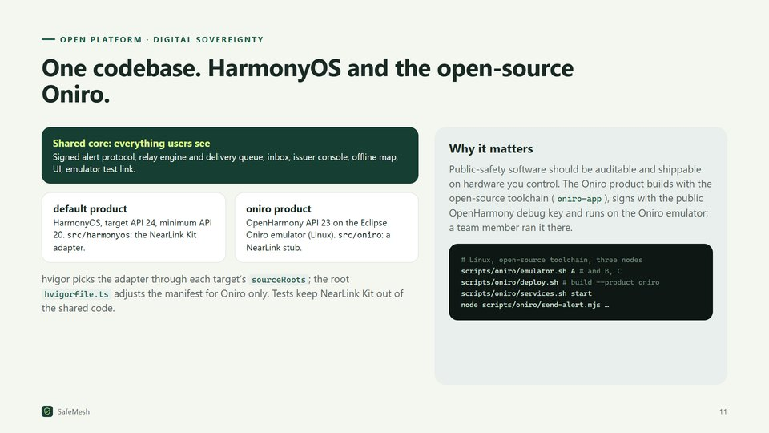

> The challenge asks what an open mobile platform makes possible. SafeMesh shows the code is not locked to one vendor: the same repository produces a HarmonyOS package with NearLink and an OpenHarmony package for Oniro, differing only where the platform requires it. COMMANDS.md documents the Linux workflow.

### 12. Architecture

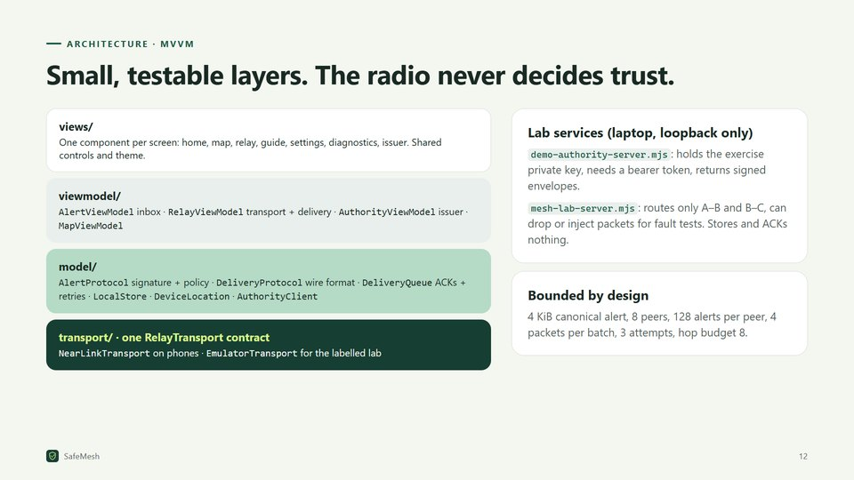

> The UI shell, pages/Index.ets, was split from 1,150 lines into screen components; 16 of 19 screens were pixel-identical afterwards and the rest differ only in a timestamp or scroll offset. The model layer has no UI dependencies, which is why 177 host tests can run the real ArkTS code.

### 13. Evidence

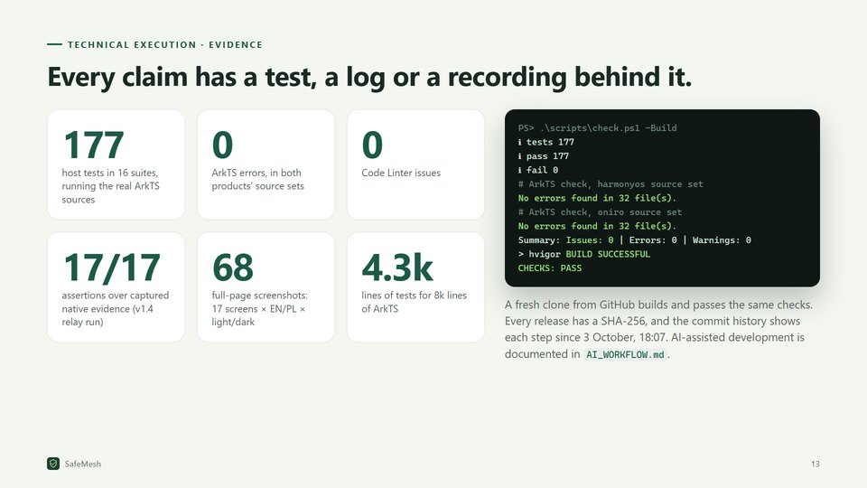

> The terminal lines are copied from artifacts/logs/v160-checks-build.log. The 17 of 17 evidence assertions are in artifacts/logs/authority-v14-assertions.json. The screen gallery is generated by scripts/capture-gallery.py.

### 14. Honest status

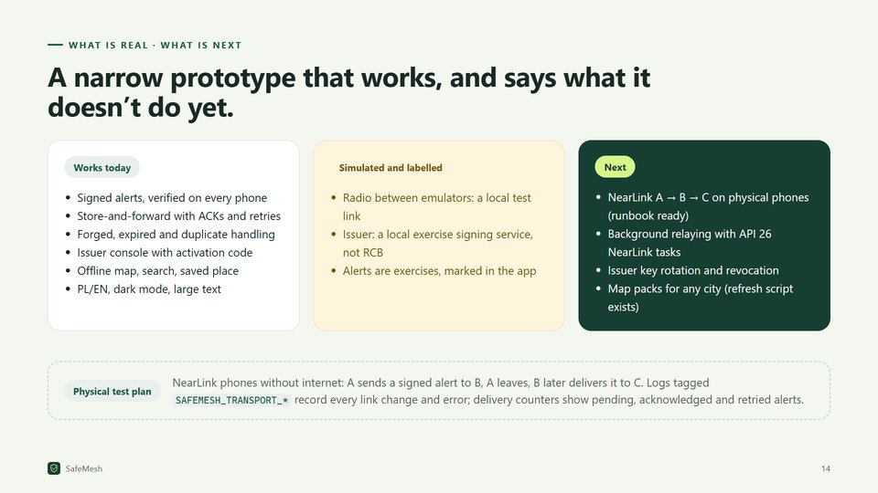

> We would rather show a narrow solution that works than a broad concept. The two stand-ins are labelled in the app and in the README. The physical NearLink test plan, including signing for phones, is in docs/PHYSICAL_TESTING.md.

### 15. Against the criteria

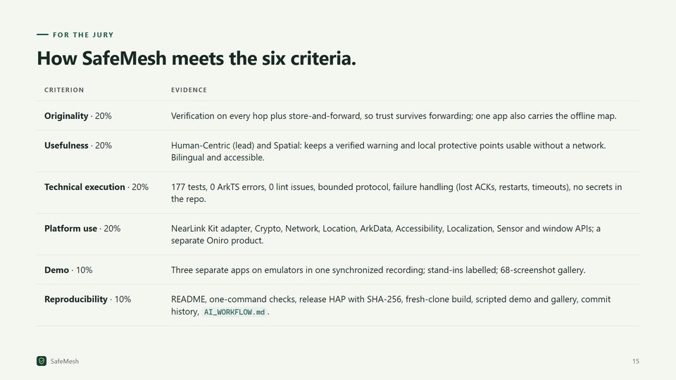

> This slide is a map for the jury: each line points to evidence in the repository. The README section "For the jury: start here" has the same links.

### 16. Thank you

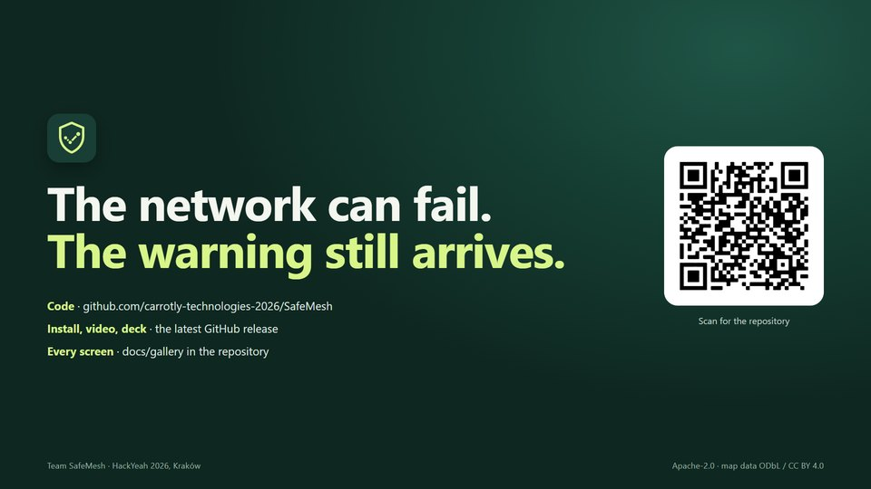

> Thank you. The repository README starts with a section for the jury that links the release, the demo video, this deck, the screen gallery and the test logs.
